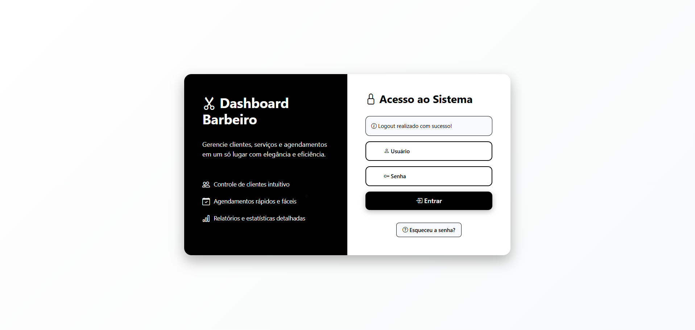
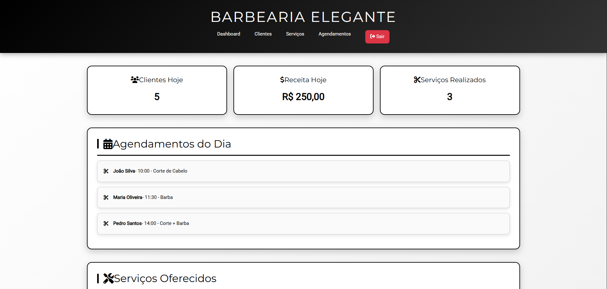
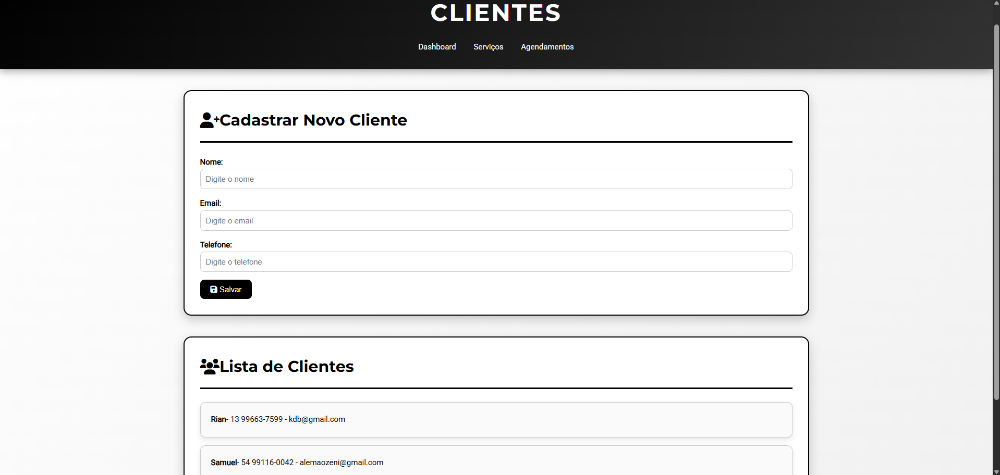
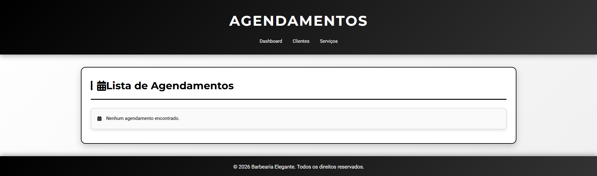

# Dashboard Barbearia 💈


Sistema de gerenciamento para barbearia, desenvolvido em **Django**.  
O objetivo é centralizar o controle de clientes, serviços e agendamentos em um painel simples e elegante.

---

🚀 Funcionalidades atuais
- Cadastro e listagem de clientes
- Login e logout com mensagens de sucesso
- Interface estilizada com HTML + CSS

---

📂 Estrutura do projeto
- `apps/clientes/`
  - `models.py` → modelo **Cliente**
  - `forms.py` → formulário **ClienteForm**
  - `views.py` → view **lista_clientes** (cadastro + listagem)
  - `urls.py` → rotas do app clientes
  - `templates/clientes/lista.html` → página de clientes (formulário + lista)

---

🛠️ Tecnologias utilizadas

Python 3.14

Django 6.0

HTML5 / CSS3

Font Awesome (ícones)
## ⚙️ Como rodar o projeto

---

## 📸 Prints da aplicação

### Tela de Login


### Dashboard


### Clientes


### Serviços


### Agendamentos


---

## 🗺️ Roadmap

### ✅ Concluído
- Cadastro e listagem de clientes
- Login e logout com mensagens de sucesso
- Interface estilizada com HTML + CSS
- Estrutura inicial do projeto (apps, models, forms, views, urls, templates)
- Documentação inicial no README

### 🚧 Em andamento
- CRUD completo de clientes (editar e excluir)
- Base template (`base.html`) com menu global
- Estilização avançada com Bootstrap/Tailwind

### 🔮 Futuro
- Módulo de serviços (cadastro e listagem)
- Módulo de agendamentos (agenda de horários)
- Dashboard com estatísticas (quantidade de clientes, serviços mais usados etc.)
- Deploy em plataforma (Render/Railway/Heroku)
- Testes automatizados
---
1. Clone o repositório:
   ```bash
   git clone https://github.com/seuusuario/dashboard-barbeiro.git
   cd dashboard-barbeiro

2. Crie e ative o ambiente virtual:
- python -m venv venv
- source venv/bin/activate   # Linux/Mac
- venv\Scripts\activate      # Windows

3. Instale as dependências:
- pip install -r requirements.txt

4. Execute as migrações:
- python manage.py migrate

6. Acesse no navegador:

http://localhost:8000/clientes/ → cadastro e lista de clientes

http://localhost:8000/clientes/login/ → login

http://localhost:8000/logout/ → logout

